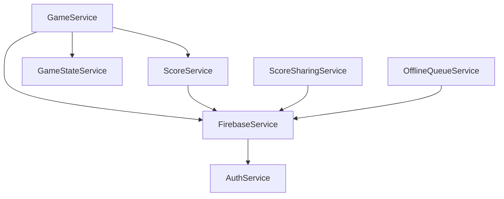

# Services Architecture - January 2025

## Core Services

### Authentication & Authorization
- `AuthService`: Firebase auth, user roles, guest sessions
- `ValidationService`: Data validation, format checks
- `VersionService`: App version control

### Game Logic
- `GameService`: Core game mechanics
- `GameStateService`: State management
- `ScoreService`: Score calculations
- `ScoreSharingService`: Social sharing

### Data Management
- `FirebaseService`: Database operations
- `DataCollectionService`: Analytics data
- `OfflineQueueService`: Offline functionality
- `QuarterPopulationService`: Quarter data

### Integration
- `AnalyticsService`: Usage tracking
- `ShopifyService`: E-commerce integration

## Dependencies & Flow


## Service Status Dashboard

| Service | Status | Dependencies | Critical |
|---------|---------|--------------|-----------|
| Auth | ✅ | Firebase | Yes |
| Game | ✅ | Firebase, Score | Yes |
| Score | ✅ | Firebase | Yes |
| Firebase | ✅ | Auth | Yes |
| Analytics | ✅ | - | No |
| Validation | ✅ | - | No |

## Configuration Requirements

### Firebase Service
```typescript
interface FirebaseConfig {
  apiKey: string;
  persistence: 'LOCAL' | 'SESSION';
  collection: {
    users: string;
    scores: string;
    quarters: string;
  };
}
```

### Game Service
```typescript
interface GameConfig {
  maxAttempts: number;
  scoreMultiplier: number;
  timeLimit?: number;
}
```

## Error Handling

### Critical Services
- Implement retry logic
- Queue offline operations
- Log errors to Analytics
- Show user feedback

### Non-Critical Services
- Graceful degradation
- Silent retry
- Default to offline mode

## FOR_CLAUDE
- Monitor service dependencies
- Check for circular dependencies
- Validate error handling
- Ensure offline support